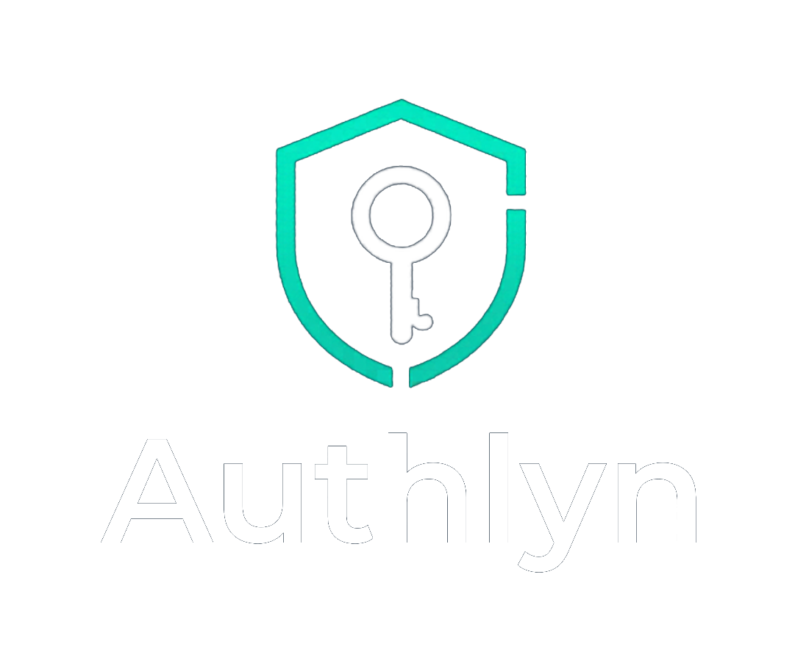

<!-- markdownlint-disable MD033 -->
<p align="center">
  
</p>

<p align="center">
  <a href="LICENSE"></a>
  
  
  
</p>
<!-- markdownlint-enable MD033 -->

Authlyn is a full-stack IAM platform scaffold with a Spring Boot backend and a React + Vite frontend.

- Backend: JWT/JWKS baseline, OAuth2 resource-server setup, Flyway, PostgreSQL, Redis
- Frontend: typed API client baseline and health/meta integration
- Docs: architecture, phased tasks, and lightweight planning docs

[License](LICENSE) · [Contributing](CONTRIBUTING.md) · [Security](SECURITY.md) · [Issues](https://github.com/RainyinSaiGon/Authlyn/issues)

## Project status

Authlyn is currently in scaffold/build-out mode. The repository contains foundational auth/security and project structure, not a complete IAM product yet.

## Repository layout

```text
Authlyn/
|- README.md
|- ARCHITECTURE.md
|- Specs.md
|- docs/
|  |- architecture/
|  |- tasks/
|  |- features/
|  |- design/
|  |- tests/
|  |- runbooks/
|  |- status/
|  |- user-manual/
|  |- workflows/
|  `- UC/
|- frontend/
|- src/
|- docker-compose.yml
`- build.gradle
```

## Tech stack

- Java `25`
- Spring Boot `4.0.5`
- Gradle wrapper
- PostgreSQL
- Redis
- Flyway
- React + Vite + TypeScript

## Prerequisites

- Java 25
- Node.js 20+ and npm
- Docker runtime (for local Redis)
- PostgreSQL access (Neon is the current team baseline)

## Local setup

1. Copy environment template.
2. Fill database credentials.
3. Start Redis with Docker Compose.
4. Run backend.
5. Run frontend.

### Backend

```powershell
Copy-Item .env.example .env
docker compose up -d
.\gradlew.bat bootRun
```

### Frontend

```powershell
Set-Location frontend
npm install
npm run dev
```

Frontend default URL: `http://localhost:5173`  
Backend default URL: `http://localhost:8080`

## Public endpoints (current)

- `GET /actuator/health`
- `GET /actuator/info`
- `GET /actuator/prometheus`
- `GET /.well-known/jwks.json`
- `GET /api/public/meta`

## Environment variables

Main variables are documented in [`.env.example`](.env.example). Key values include:

- `SERVER_PORT`
- `AUTHLYN_DB_URL`
- `AUTHLYN_DB_USERNAME`
- `AUTHLYN_DB_PASSWORD`
- `AUTHLYN_REDIS_HOST`
- `AUTHLYN_REDIS_PORT`
- `AUTHLYN_REDIS_PASSWORD`
- `AUTHLYN_JWT_ISSUER`
- `AUTHLYN_JWK_SET_URI`
- `AUTHLYN_ACCESS_TOKEN_MINUTES`
- `AUTHLYN_REFRESH_TOKEN_DAYS`
- `AUTHLYN_BCRYPT_STRENGTH`
- `AUTHLYN_ALLOWED_ORIGINS`

## Docs

- Root architecture overview: [`ARCHITECTURE.md`](ARCHITECTURE.md)
- Docs index: [`docs/README.md`](docs/README.md)
- Implementation roadmap/tasks: [`docs/tasks/README.md`](docs/tasks/README.md)

## Contributing

Please read:

- [`CONTRIBUTING.md`](CONTRIBUTING.md)
- [`.github/CODE_OF_CONDUCT.md`](.github/CODE_OF_CONDUCT.md)
- [`SECURITY.md`](SECURITY.md)

## License

MIT — see [`LICENSE`](LICENSE).
