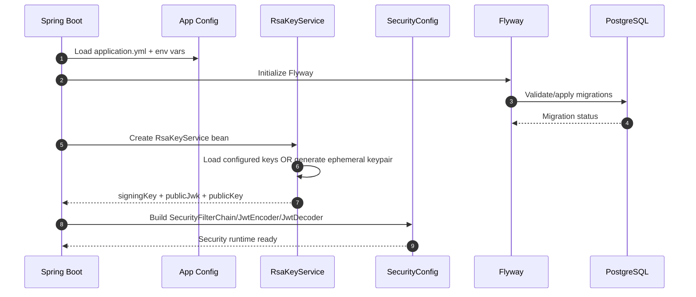
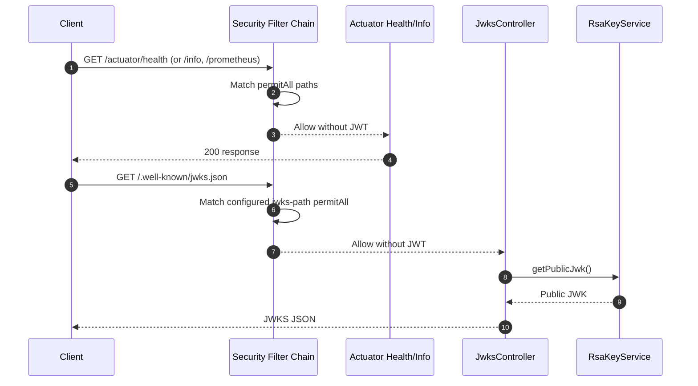
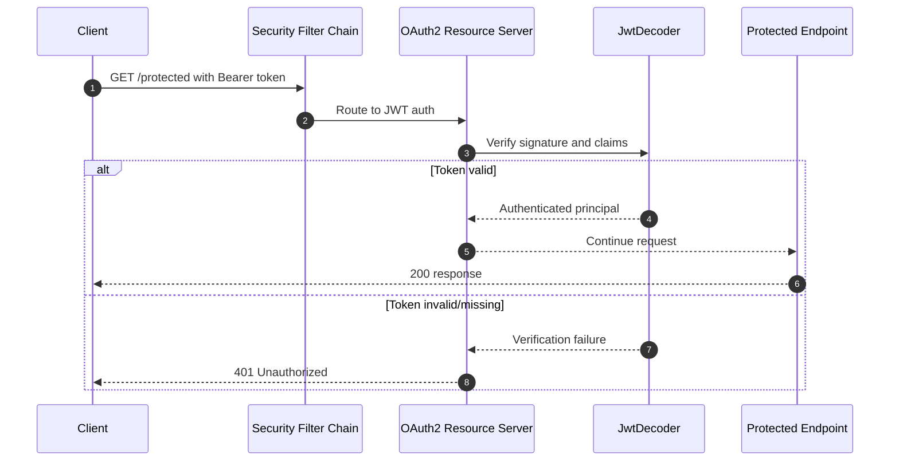

# Current Implemented Flows (Authlyn)

This document covers only flows that are implemented in the current codebase.

## Scope

Implemented today:

- Application startup with Spring Boot auto-configuration
- Security filter behavior (public vs protected endpoints)
- RSA key loading / generation and JWKS exposure
- JWT verification for protected requests (resource server mode)

Not yet implemented:

- Signup/login APIs
- Refresh-token rotation endpoint flow
- Logout/logout-all-devices endpoint flow
- MFA challenge/verification

## Flow 1: Application startup

## Flow 2: Public endpoint access

Public endpoints are permitted by `SecurityConfig`:

- `/actuator/health`
- `/actuator/info`
- `/actuator/prometheus`
- `${authlyn.jwt.jwks-path}` (default `/.well-known/jwks.json`)

## Flow 3: Protected endpoint request (JWT verification)

Any path not explicitly permitted requires authentication.

## Notes

- JWT issuance endpoint flow is not implemented yet in controllers/services, but encoder wiring is already present.
- If RSA keys are not configured, generated keys are ephemeral and will change on restart.
- Detailed key-management and rotation guidance is in:
  - [`jwt-jwks-flow.md`](./jwt-jwks-flow.md)
