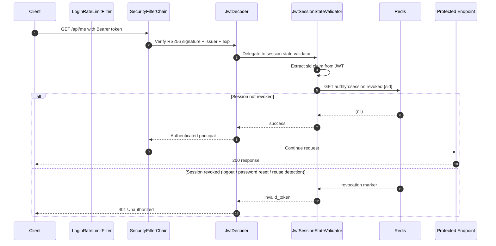
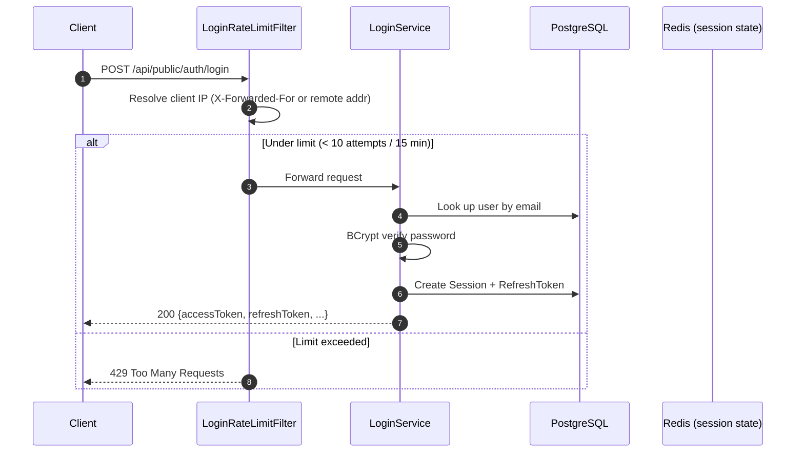
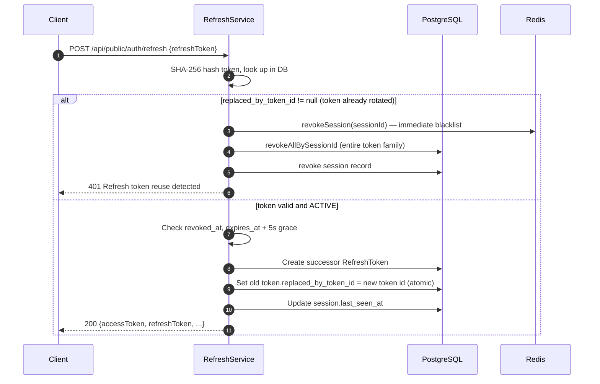
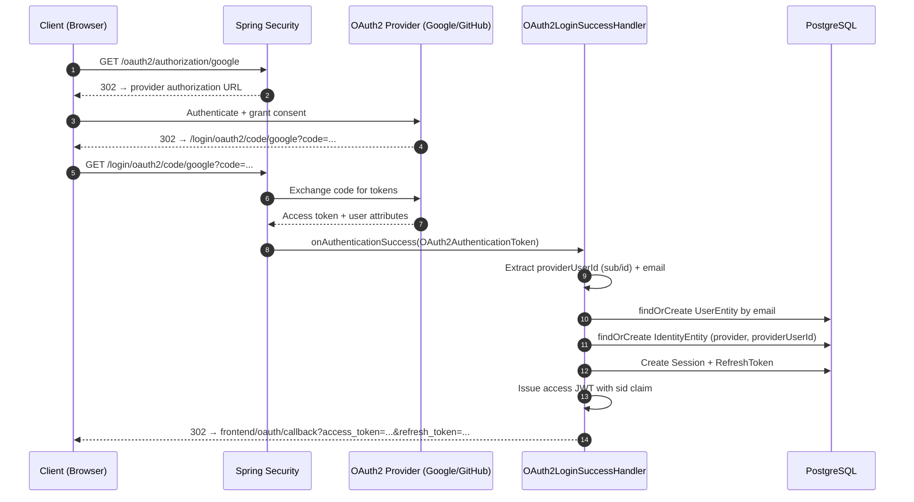
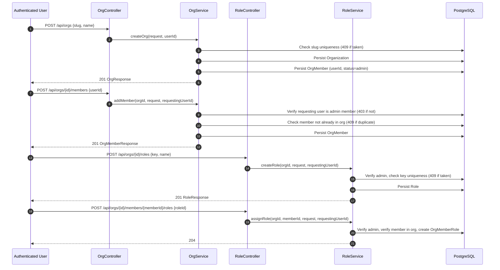

# Current Implemented Flows (Authlyn)

This document covers only flows that are fully implemented in the current codebase.

## Scope

### Implemented

- Application startup: RSA key loading (multi-strategy), signing benchmark, Flyway migration, security filter chain
- Security filter chain: login rate limiting (Bucket4j), JWT resource server, optional OAuth2 login
- RSA key loading via strategy pattern (`InlinePem`, `SpringResource`, `Filesystem`, `Fallback`)
- JWT signing and validation (RS256, session-state revocation via Redis)
- JWKS endpoint
- Sign-up, login, refresh rotation with reuse detection, logout, logout-all
- Password reset request and confirm
- OAuth2 social login (Google, GitHub) with identity linking
- Organization CRUD and membership management
- Role management and role assignment to org members
- Strong password validation (`@StrongPassword`)
- Redis-backed session revocation (checked on every authenticated request)

### Not yet implemented

- MFA (TOTP, passkeys, recovery codes)
- Audit log write path (schema exists, service layer not yet wired)
- Signup rate limiting
- Email verification flow
- Session list / revoke-by-session-id UI endpoints
- API key lifecycle, webhooks, OIDC discovery, SAML

---

## Flow 1: Application Startup

```mermaid
sequenceDiagram
    autonumber
    participant P as Spring Boot
    participant F as Flyway
    participant D as PostgreSQL
    participant R as RsaKeyService
    participant S as SecurityConfig

    P->>F: Initialize Flyway
    F->>D: Validate/apply migrations (V1–V3)
    D-->>F: OK

    P->>R: Create RsaKeyService bean
    R->>R: Resolve key via strategy chain (InlinePem → SpringResource → Filesystem → Fallback)
    R->>R: Derive public key from CRT params
    R->>R: Measure signing throughput (CRT vs non-CRT comparison)
    Note over R: Logs: CRT form: true; throughput: X ns/op; CRT speedup: Y%
    R-->>P: signingKey + publicJwk + publicKey

    P->>S: Build SecurityFilterChain
    Note over S: Registers LoginRateLimitFilter + JWT resource server
    Note over S: Conditionally registers oauth2Login if ClientRegistrationRepository present
    S-->>P: Security runtime ready
```

---

## Flow 2: Protected Endpoint Request (Two-Layer JWT Validation)

```mermaid
sequenceDiagram
    autonumber
    participant U as Client
    participant RL as LoginRateLimitFilter
    participant SF as SecurityFilterChain
    participant JD as JwtDecoder
    participant SV as JwtSessionStateValidator
    participant Redis as Redis
    participant API as Protected Endpoint

    U->>SF: GET /api/me with Bearer token
    SF->>JD: Verify RS256 signature + issuer + exp
    JD->>SV: Delegate to session state validator
    SV->>SV: Extract sid claim from JWT
    SV->>Redis: GET authlyn:session:revoked:{sid}
    alt Session not revoked
        Redis-->>SV: (nil)
        SV-->>JD: success
        JD-->>SF: Authenticated principal
        SF->>API: Continue request
        API-->>U: 200 response
    else Session revoked (logout / password reset / reuse detection)
        Redis-->>SV: revocation marker
        SV-->>JD: invalid_token
        JD-->>U: 401 Unauthorized
    end
```

---

## Flow 3: Login with Rate Limiting

```mermaid
sequenceDiagram
    autonumber
    participant U as Client
    participant RL as LoginRateLimitFilter
    participant LS as LoginService
    participant DB as PostgreSQL
    participant Redis as Redis (session state)

    U->>RL: POST /api/public/auth/login
    RL->>RL: Resolve client IP (X-Forwarded-For or remote addr)
    alt Under limit (< 10 attempts / 15 min)
        RL->>LS: Forward request
        LS->>DB: Look up user by email
        LS->>LS: BCrypt verify password
        LS->>DB: Create Session + RefreshToken
        LS-->>U: 200 {accessToken, refreshToken, ...}
    else Limit exceeded
        RL-->>U: 429 Too Many Requests
    end
```

---

## Flow 4: Refresh Token Rotation with Reuse Detection

```mermaid
sequenceDiagram
    autonumber
    participant U as Client
    participant RS as RefreshService
    participant DB as PostgreSQL
    participant Redis as Redis

    U->>RS: POST /api/public/auth/refresh {refreshToken}
    RS->>RS: SHA-256 hash token, look up in DB
    alt replaced_by_token_id != null (token already rotated)
        RS->>Redis: revokeSession(sessionId) — immediate blacklist
        RS->>DB: revokeAllBySessionId (entire token family)
        RS->>DB: revoke session record
        RS-->>U: 401 Refresh token reuse detected
    else token valid and ACTIVE
        RS->>RS: Check revoked_at, expires_at + 5s grace
        RS->>DB: Create successor RefreshToken
        RS->>DB: Set old token.replaced_by_token_id = new token id (atomic)
        RS->>DB: Update session.last_seen_at
        RS-->>U: 200 {accessToken, refreshToken, ...}
    end
```

---

## Flow 5: OAuth2 Social Login

```mermaid
sequenceDiagram
    autonumber
    participant U as Client (Browser)
    participant SP as Spring Security
    participant OP as OAuth2 Provider (Google/GitHub)
    participant OH as OAuth2LoginSuccessHandler
    participant DB as PostgreSQL

    U->>SP: GET /oauth2/authorization/google
    SP-->>U: 302 → provider authorization URL

    U->>OP: Authenticate + grant consent
    OP-->>U: 302 → /login/oauth2/code/google?code=...

    U->>SP: GET /login/oauth2/code/google?code=...
    SP->>OP: Exchange code for tokens
    OP-->>SP: Access token + user attributes

    SP->>OH: onAuthenticationSuccess(OAuth2AuthenticationToken)
    OH->>OH: Extract providerUserId (sub/id) + email
    OH->>DB: findOrCreate UserEntity by email
    OH->>DB: findOrCreate IdentityEntity (provider, providerUserId)
    OH->>DB: Create Session + RefreshToken
    OH->>OH: Issue access JWT with sid claim
    OH-->>U: 302 → frontend/oauth/callback?access_token=...&refresh_token=...
```

---

## Flow 6: Org and Role Management

All endpoints require an authenticated user (`bearer-user`). Admin-gate checks (`status = 'admin'`) are enforced at the service layer.

```mermaid
sequenceDiagram
    autonumber
    participant U as Authenticated User
    participant OC as OrgController
    participant OS as OrgService
    participant RC as RoleController
    participant RS as RoleService
    participant DB as PostgreSQL

    U->>OC: POST /api/orgs {slug, name}
    OC->>OS: createOrg(request, userId)
    OS->>DB: Check slug uniqueness (409 if taken)
    OS->>DB: Persist Organization
    OS->>DB: Persist OrgMember (userId, status=admin)
    OS-->>U: 201 OrgResponse

    U->>OC: POST /api/orgs/{id}/members {userId}
    OC->>OS: addMember(orgId, request, requestingUserId)
    OS->>DB: Verify requesting user is admin member (403 if not)
    OS->>DB: Check member not already in org (409 if duplicate)
    OS->>DB: Persist OrgMember
    OS-->>U: 201 OrgMemberResponse

    U->>RC: POST /api/orgs/{id}/roles {key, name}
    RC->>RS: createRole(orgId, request, requestingUserId)
    RS->>DB: Verify admin, check key uniqueness (409 if taken)
    RS->>DB: Persist Role
    RS-->>U: 201 RoleResponse

    U->>RC: POST /api/orgs/{id}/members/{memberId}/roles {roleId}
    RC->>RS: assignRole(orgId, memberId, request, requestingUserId)
    RS->>DB: Verify admin, verify member in org, create OrgMemberRole
    RS-->>U: 204
```
