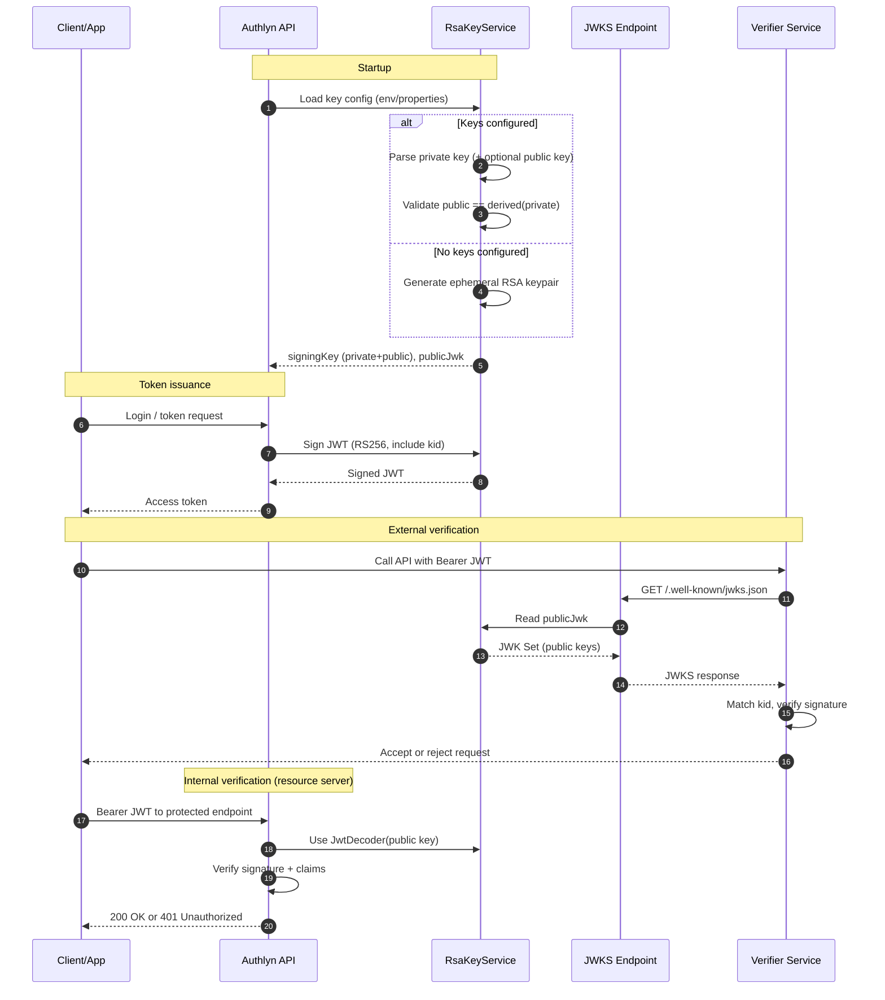
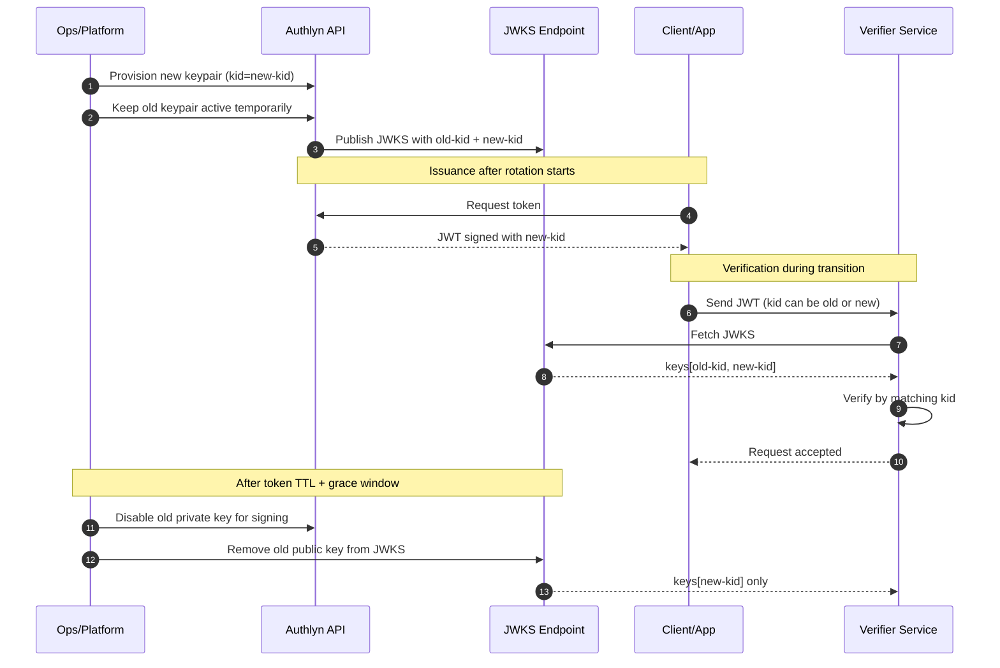

# JWT + JWKS Flow in Authlyn

This document explains how Authlyn manages RSA keys, signs JWTs, and exposes JWKS for token verification.

## Components

- `AuthlynJwtProperties` — binds `authlyn.jwt.*` configuration.
- `RsaKeyService` — loads or generates RSA key material, validates key consistency, and builds JWK objects.
- `SecurityConfig` — wires Spring `JwtEncoder` and `JwtDecoder` with keys from `RsaKeyService`.
- `JwksController` — exposes the public key set at `GET /.well-known/jwks.json` (or configured path).

## Startup behavior

At application startup:

1. `RsaKeyService` reads key inputs from config (`private-key(-path)`, `public-key(-path)`).
2. If no private key is provided, it generates an ephemeral RSA keypair.
3. If private key is provided without public key, it derives the public key from private key.
4. If both are provided, it verifies they match.
5. It builds:
   - signing key (private + public) for JWT signing
   - public JWK for JWKS exposure

## Sequence flow

## Operational notes

- Ephemeral keys are useful for local development and tests, but all issued tokens become invalid after restart.
- For stable environments, provide persistent RSA key material via env vars.
- Keep private keys secret; only public keys should be exposed via JWKS.
- Use `kid` to support safe key rotation and multi-key transitions.

## Key rotation flow (recommended rollout)

Use this approach to rotate keys without breaking in-flight tokens.

### Rotation steps

1. Generate a new RSA keypair and assign a new `kid`.
2. Start signing new tokens with the new private key and new `kid`.
3. Publish both old and new public keys in JWKS during a transition window.
4. Keep old key available until all old access tokens and refresh-token-derived access tokens are expired.
5. Remove old key from JWKS after the grace period.

### Rotation sequence diagram

### Practical timing guidance

- Minimum overlap window: at least your **maximum token validity**.
- Safer overlap window: maximum access-token lifetime + clock skew + cache TTL buffer.
- If verifiers cache JWKS aggressively, use a longer overlap window.

### Failure prevention checklist

- Never remove old public key before all old tokens are naturally invalid.
- Ensure issued JWT header always includes `kid`.
- Monitor 401/invalid-signature spikes during rollout.
- Roll out verifier services before removing old keys.

## Key rotation runbook 

Use this timeline as an operational checklist during rotation.

### T-7d (prepare)

- Generate new RSA keypair in your secure secret store.
- Assign a new `kid` (for example `authlyn-rsa-2026-04`).
- Confirm verifiers can fetch JWKS successfully.
- Confirm token TTL settings (`access-token-minutes`, refresh strategy).
- Announce maintenance window and rollback owner.

### T-1d (staging validation)

- Deploy to staging with both public keys published in JWKS.
- Switch signer in staging to the new private key (`kid=new`).
- Smoke check: New token uses `kid=new`.
- Smoke check: Old token with `kid=old` still verifies.
- Smoke check: `/.well-known/jwks.json` returns both keys.
- Verify no signature-related 401 spikes in logs/metrics.

### T+0 (production cutover)

- Deploy production signer with new private key (`kid=new`).
- Keep old public key in JWKS.
- Monitor auth failure rate.
- Monitor JWT signature verification errors.
- Monitor downstream verifier health checks.
- If severe issues occur, rollback signer to old key while keeping both keys in JWKS.

### T+7d (or after max token lifetime + buffer)

- Validate old-token traffic has dropped to near-zero.
- Remove old public key from JWKS.
- Re-run verifier smoke checks with only `kid=new`.
- Close rotation incident/change record.

### Rollback plan (quick)

1. Re-enable old signer key immediately.
2. Publish both keys in JWKS.
3. Clear or reduce JWKS cache TTL in verifiers if possible.
4. Re-check signature validation and auth success rates.
