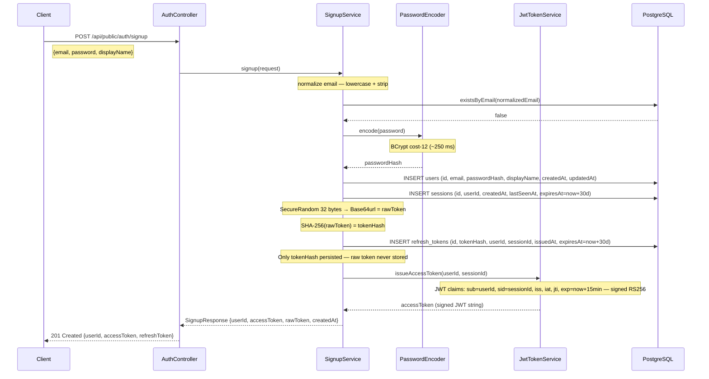
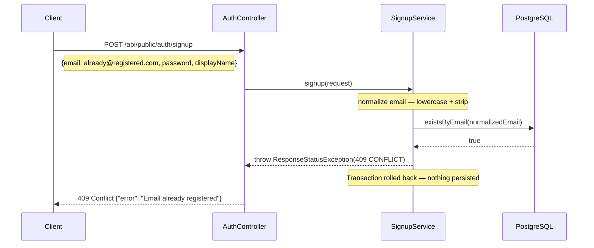

# Signup — Sequence Diagrams

## Case 1a: Happy Path

```mermaid
sequenceDiagram
    participant C as Client
    participant AC as AuthController
    participant SS as SignupService
    participant PE as PasswordEncoder
    participant JT as JwtTokenService
    participant DB as PostgreSQL

    C->>AC: POST /api/public/auth/signup
    Note right of C: {email, password, displayName}
    AC->>SS: signup(request)
    Note over SS: normalize email — lowercase + strip
    SS->>DB: existsByEmail(normalizedEmail)
    DB-->>SS: false
    SS->>PE: encode(password)
    Note over PE: BCrypt cost-12 (~250 ms)
    PE-->>SS: passwordHash
    SS->>DB: INSERT users (id, email, passwordHash, displayName, createdAt, updatedAt)
    SS->>DB: INSERT sessions (id, userId, createdAt, lastSeenAt, expiresAt=now+30d)
    Note over SS: SecureRandom 32 bytes → Base64url = rawToken
    Note over SS: SHA-256(rawToken) = tokenHash
    SS->>DB: INSERT refresh_tokens (id, tokenHash, userId, sessionId, issuedAt, expiresAt=now+30d)
    Note over SS: Only tokenHash persisted — raw token never stored
    SS->>JT: issueAccessToken(userId, sessionId)
    Note over JT: JWT claims: sub=userId, sid=sessionId, iss, iat, jti, exp=now+15min — signed RS256
    JT-->>SS: accessToken (signed JWT string)
    SS-->>AC: SignupResponse {userId, accessToken, rawToken, createdAt}
    AC-->>C: 201 Created {userId, accessToken, refreshToken}
```

## Case 1b: Email Already Registered

```mermaid
sequenceDiagram
    participant C as Client
    participant AC as AuthController
    participant SS as SignupService
    participant DB as PostgreSQL

    C->>AC: POST /api/public/auth/signup
    Note right of C: {email: already@registered.com, password, displayName}
    AC->>SS: signup(request)
    Note over SS: normalize email — lowercase + strip
    SS->>DB: existsByEmail(normalizedEmail)
    DB-->>SS: true
    SS-->>AC: throw ResponseStatusException(409 CONFLICT)
    Note over SS: Transaction rolled back — nothing persisted
    AC-->>C: 409 Conflict {"error": "Email already registered"}
```
