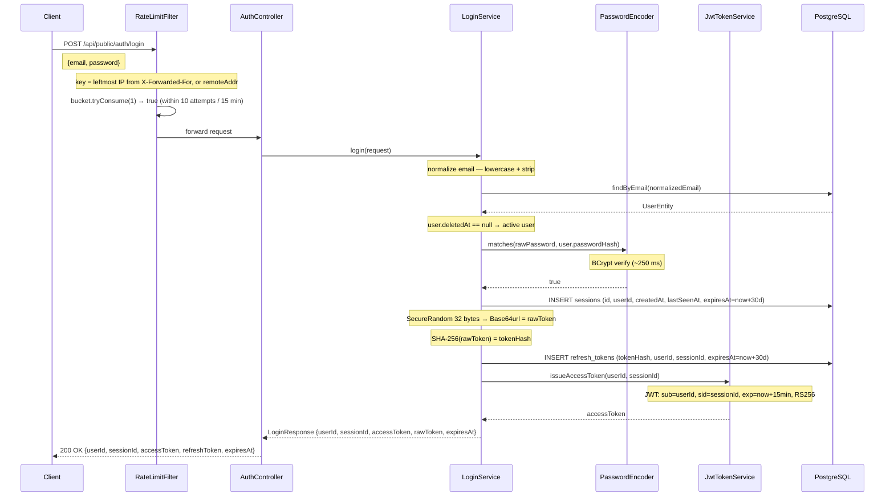
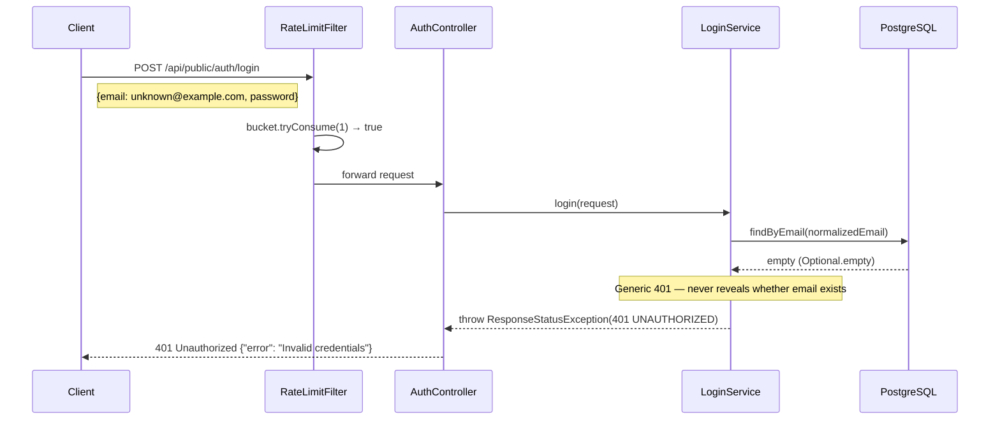
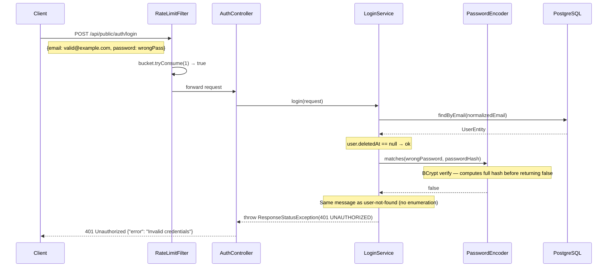
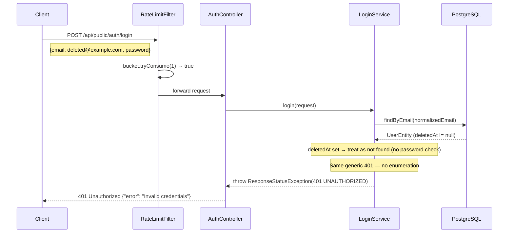
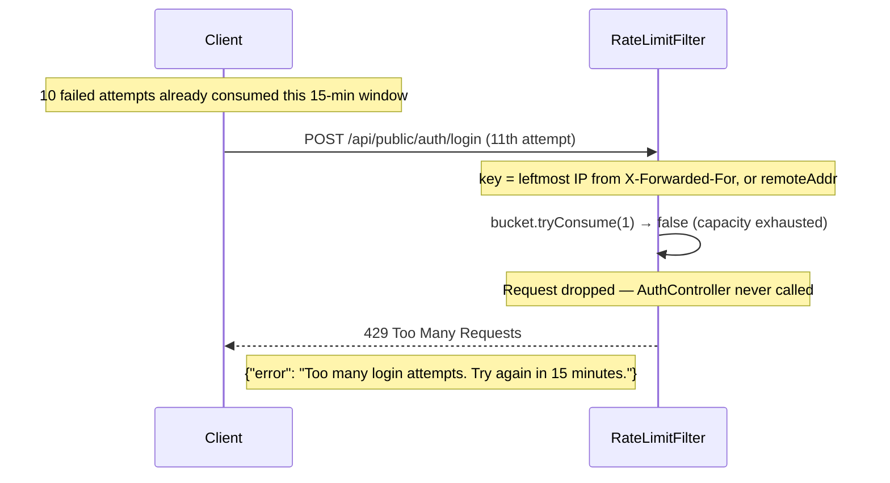

# Login — Sequence Diagrams

## Case 2a: Happy Path

```mermaid
sequenceDiagram
    participant C as Client
    participant RL as RateLimitFilter
    participant AC as AuthController
    participant LS as LoginService
    participant PE as PasswordEncoder
    participant JT as JwtTokenService
    participant DB as PostgreSQL

    C->>RL: POST /api/public/auth/login
    Note right of C: {email, password}
    Note over RL: key = leftmost IP from X-Forwarded-For, or remoteAddr
    RL->>RL: bucket.tryConsume(1) → true (within 10 attempts / 15 min)
    RL->>AC: forward request
    AC->>LS: login(request)
    Note over LS: normalize email — lowercase + strip
    LS->>DB: findByEmail(normalizedEmail)
    DB-->>LS: UserEntity
    Note over LS: user.deletedAt == null → active user
    LS->>PE: matches(rawPassword, user.passwordHash)
    Note over PE: BCrypt verify (~250 ms)
    PE-->>LS: true
    LS->>DB: INSERT sessions (id, userId, createdAt, lastSeenAt, expiresAt=now+30d)
    Note over LS: SecureRandom 32 bytes → Base64url = rawToken
    Note over LS: SHA-256(rawToken) = tokenHash
    LS->>DB: INSERT refresh_tokens (tokenHash, userId, sessionId, expiresAt=now+30d)
    LS->>JT: issueAccessToken(userId, sessionId)
    Note over JT: JWT: sub=userId, sid=sessionId, exp=now+15min, RS256
    JT-->>LS: accessToken
    LS-->>AC: LoginResponse {userId, sessionId, accessToken, rawToken, expiresAt}
    AC-->>C: 200 OK {userId, sessionId, accessToken, refreshToken, expiresAt}
```

## Case 2b: User Not Found

```mermaid
sequenceDiagram
    participant C as Client
    participant RL as RateLimitFilter
    participant AC as AuthController
    participant LS as LoginService
    participant DB as PostgreSQL

    C->>RL: POST /api/public/auth/login
    Note right of C: {email: unknown@example.com, password}
    RL->>RL: bucket.tryConsume(1) → true
    RL->>AC: forward request
    AC->>LS: login(request)
    LS->>DB: findByEmail(normalizedEmail)
    DB-->>LS: empty (Optional.empty)
    Note over LS: Generic 401 — never reveals whether email exists
    LS-->>AC: throw ResponseStatusException(401 UNAUTHORIZED)
    AC-->>C: 401 Unauthorized {"error": "Invalid credentials"}
```

## Case 2c: Wrong Password

```mermaid
sequenceDiagram
    participant C as Client
    participant RL as RateLimitFilter
    participant AC as AuthController
    participant LS as LoginService
    participant PE as PasswordEncoder
    participant DB as PostgreSQL

    C->>RL: POST /api/public/auth/login
    Note right of C: {email: valid@example.com, password: wrongPass}
    RL->>RL: bucket.tryConsume(1) → true
    RL->>AC: forward request
    AC->>LS: login(request)
    LS->>DB: findByEmail(normalizedEmail)
    DB-->>LS: UserEntity
    Note over LS: user.deletedAt == null → ok
    LS->>PE: matches(wrongPassword, passwordHash)
    Note over PE: BCrypt verify — computes full hash before returning false
    PE-->>LS: false
    Note over LS: Same message as user-not-found (no enumeration)
    LS-->>AC: throw ResponseStatusException(401 UNAUTHORIZED)
    AC-->>C: 401 Unauthorized {"error": "Invalid credentials"}
```

## Case 2d: Soft-Deleted User

```mermaid
sequenceDiagram
    participant C as Client
    participant RL as RateLimitFilter
    participant AC as AuthController
    participant LS as LoginService
    participant DB as PostgreSQL

    C->>RL: POST /api/public/auth/login
    Note right of C: {email: deleted@example.com, password}
    RL->>RL: bucket.tryConsume(1) → true
    RL->>AC: forward request
    AC->>LS: login(request)
    LS->>DB: findByEmail(normalizedEmail)
    DB-->>LS: UserEntity (deletedAt != null)
    Note over LS: deletedAt set → treat as not found (no password check)
    Note over LS: Same generic 401 — no enumeration
    LS-->>AC: throw ResponseStatusException(401 UNAUTHORIZED)
    AC-->>C: 401 Unauthorized {"error": "Invalid credentials"}
```

## Case 2e: Rate Limited (Bucket Exhausted)

```mermaid
sequenceDiagram
    participant C as Client
    participant RL as RateLimitFilter

    Note over C: 10 failed attempts already consumed this 15-min window
    C->>RL: POST /api/public/auth/login (11th attempt)
    Note over RL: key = leftmost IP from X-Forwarded-For, or remoteAddr
    RL->>RL: bucket.tryConsume(1) → false (capacity exhausted)
    Note over RL: Request dropped — AuthController never called
    RL-->>C: 429 Too Many Requests
    Note right of C: {"error": "Too many login attempts. Try again in 15 minutes."}
```
