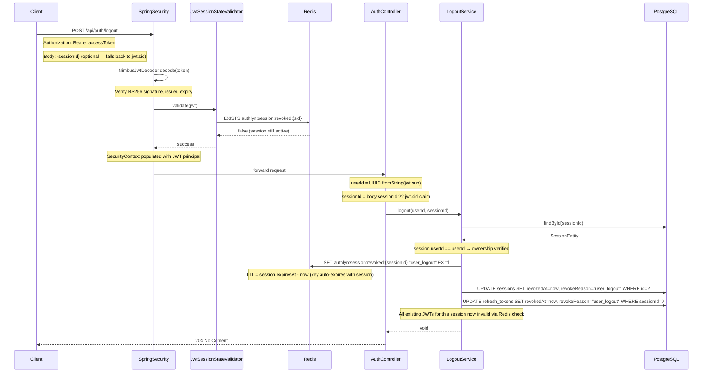
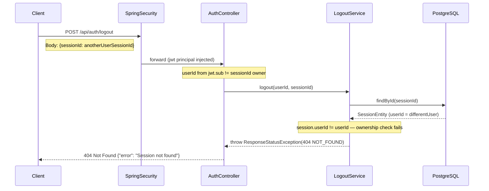
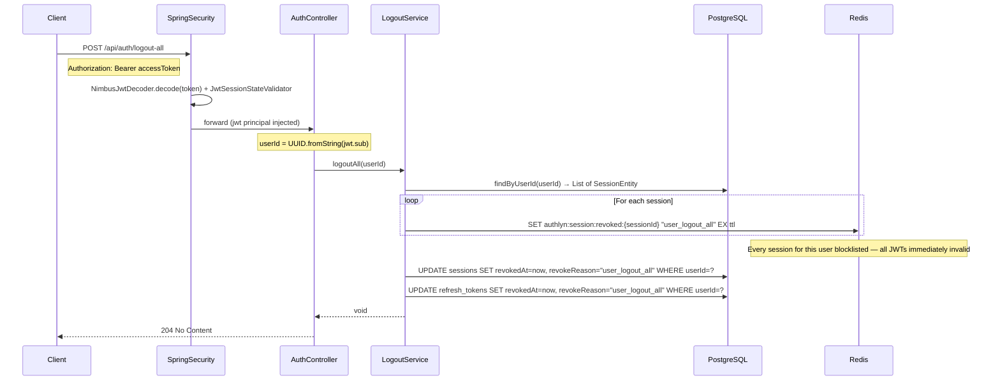

# Logout — Sequence Diagrams

## Case 4a: Logout Single Session

```mermaid
sequenceDiagram
    participant C as Client
    participant Sec as SpringSecurity
    participant Val as JwtSessionStateValidator
    participant Redis as Redis
    participant AC as AuthController
    participant LS as LogoutService
    participant DB as PostgreSQL

    C->>Sec: POST /api/auth/logout
    Note right of C: Authorization: Bearer accessToken
    Note right of C: Body: {sessionId} (optional — falls back to jwt.sid)
    Sec->>Sec: NimbusJwtDecoder.decode(token)
    Note over Sec: Verify RS256 signature, issuer, expiry
    Sec->>Val: validate(jwt)
    Val->>Redis: EXISTS authlyn:session:revoked:{sid}
    Redis-->>Val: false (session still active)
    Val-->>Sec: success
    Note over Sec: SecurityContext populated with JWT principal
    Sec->>AC: forward request
    Note over AC: userId = UUID.fromString(jwt.sub)
    Note over AC: sessionId = body.sessionId ?? jwt.sid claim
    AC->>LS: logout(userId, sessionId)
    LS->>DB: findById(sessionId)
    DB-->>LS: SessionEntity
    Note over LS: session.userId == userId → ownership verified
    LS->>Redis: SET authlyn:session:revoked:{sessionId} "user_logout" EX ttl
    Note over Redis: TTL = session.expiresAt - now (key auto-expires with session)
    LS->>DB: UPDATE sessions SET revokedAt=now, revokeReason="user_logout" WHERE id=?
    LS->>DB: UPDATE refresh_tokens SET revokedAt=now, revokeReason="user_logout" WHERE sessionId=?
    Note over LS: All existing JWTs for this session now invalid via Redis check
    LS-->>AC: void
    AC-->>C: 204 No Content
```

## Case 4b: Logout — Session Belongs to Different User

```mermaid
sequenceDiagram
    participant C as Client
    participant Sec as SpringSecurity
    participant AC as AuthController
    participant LS as LogoutService
    participant DB as PostgreSQL

    C->>Sec: POST /api/auth/logout
    Note right of C: Body: {sessionId: anotherUserSessionId}
    Sec->>AC: forward (jwt principal injected)
    Note over AC: userId from jwt.sub != sessionId owner
    AC->>LS: logout(userId, sessionId)
    LS->>DB: findById(sessionId)
    DB-->>LS: SessionEntity (userId = differentUser)
    Note over LS: session.userId != userId — ownership check fails
    LS-->>AC: throw ResponseStatusException(404 NOT_FOUND)
    AC-->>C: 404 Not Found {"error": "Session not found"}
```

## Case 4c: Logout All Sessions

```mermaid
sequenceDiagram
    participant C as Client
    participant Sec as SpringSecurity
    participant AC as AuthController
    participant LS as LogoutService
    participant DB as PostgreSQL
    participant Redis as Redis

    C->>Sec: POST /api/auth/logout-all
    Note right of C: Authorization: Bearer accessToken
    Sec->>Sec: NimbusJwtDecoder.decode(token) + JwtSessionStateValidator
    Sec->>AC: forward (jwt principal injected)
    Note over AC: userId = UUID.fromString(jwt.sub)
    AC->>LS: logoutAll(userId)
    LS->>DB: findByUserId(userId) → List of SessionEntity
    loop For each session
        LS->>Redis: SET authlyn:session:revoked:{sessionId} "user_logout_all" EX ttl
    end
    Note over Redis: Every session for this user blocklisted — all JWTs immediately invalid
    LS->>DB: UPDATE sessions SET revokedAt=now, revokeReason="user_logout_all" WHERE userId=?
    LS->>DB: UPDATE refresh_tokens SET revokedAt=now, revokeReason="user_logout_all" WHERE userId=?
    LS-->>AC: void
    AC-->>C: 204 No Content
```
